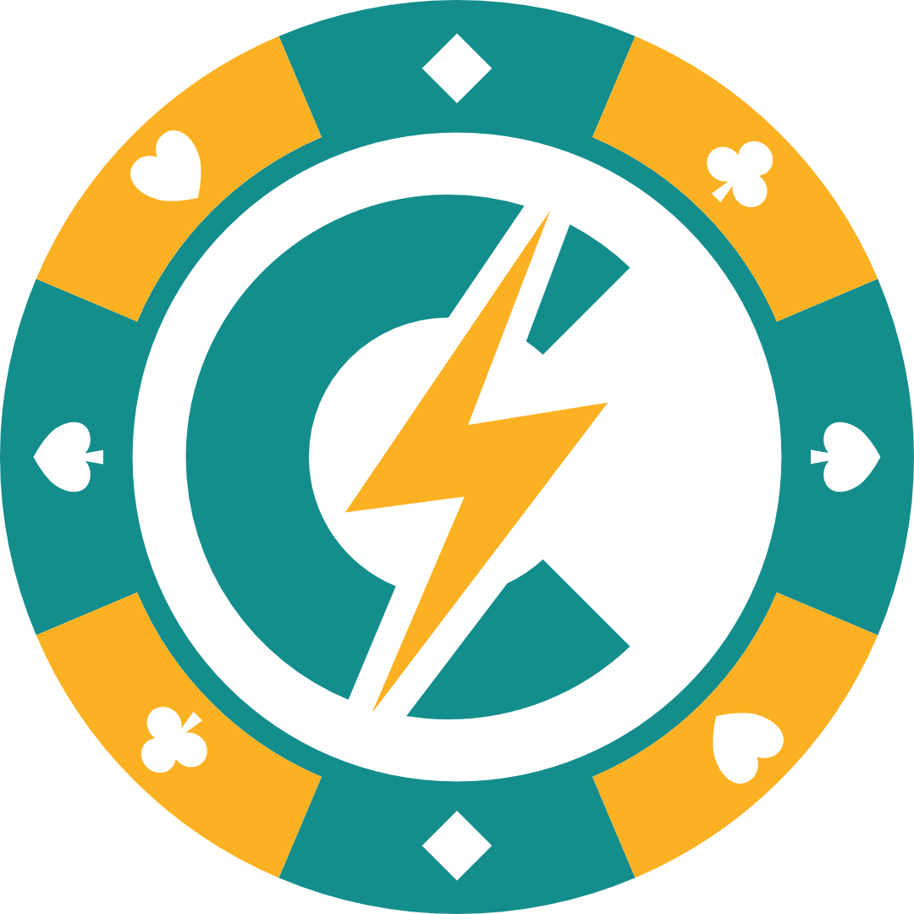
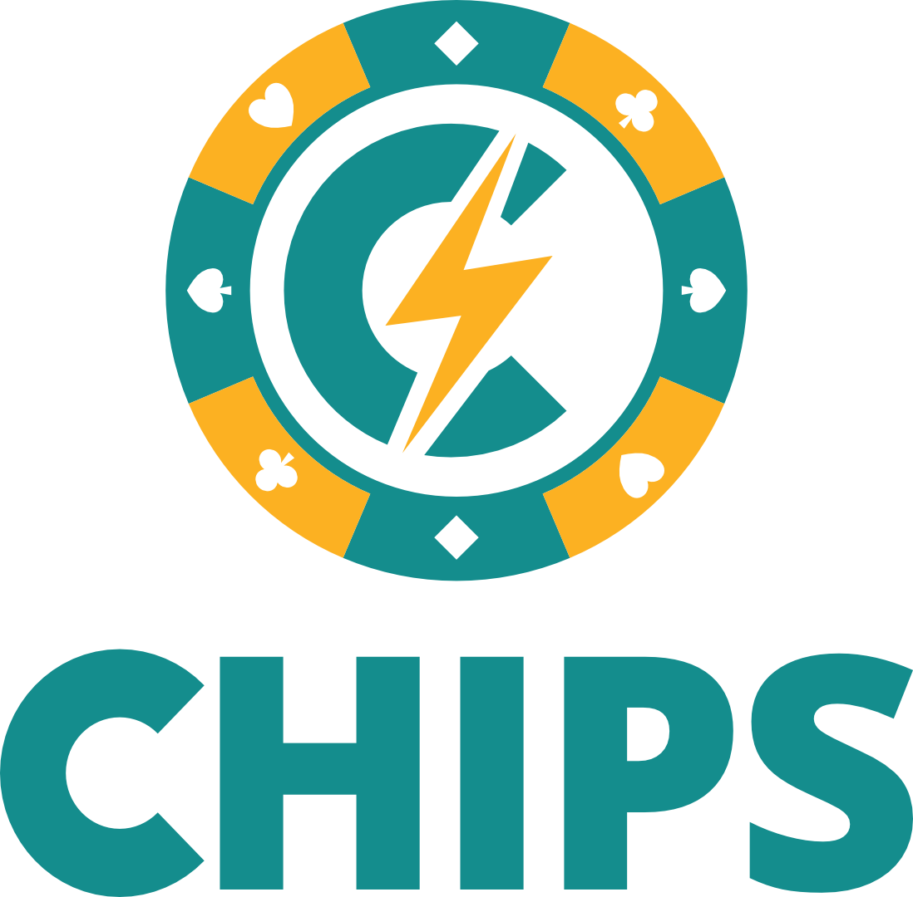
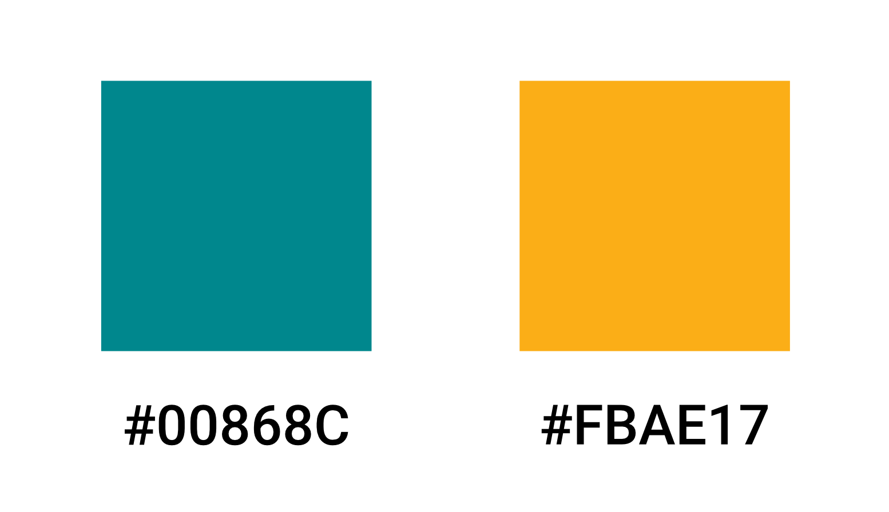
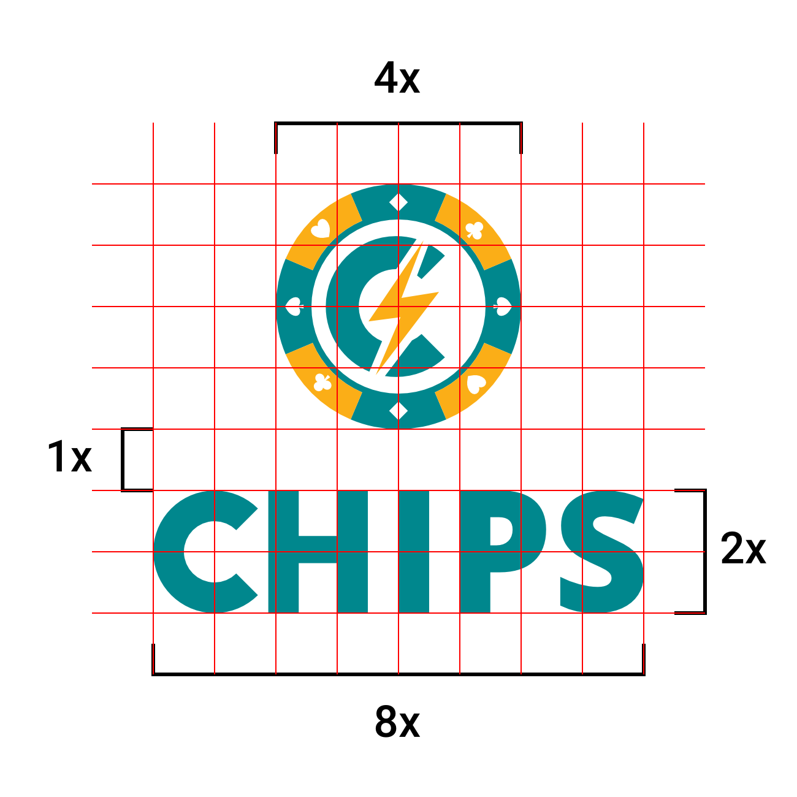
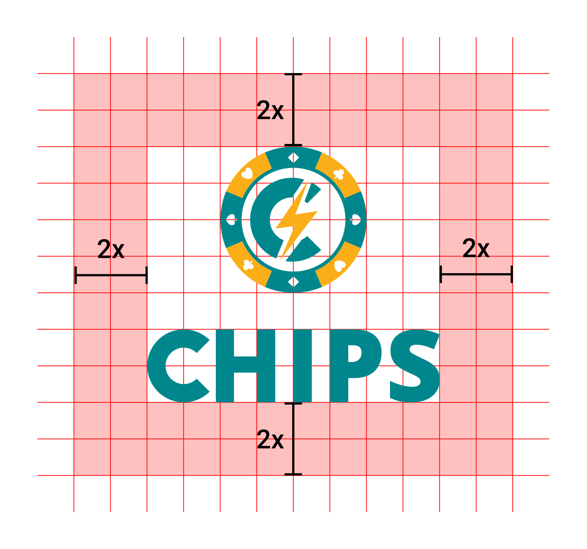
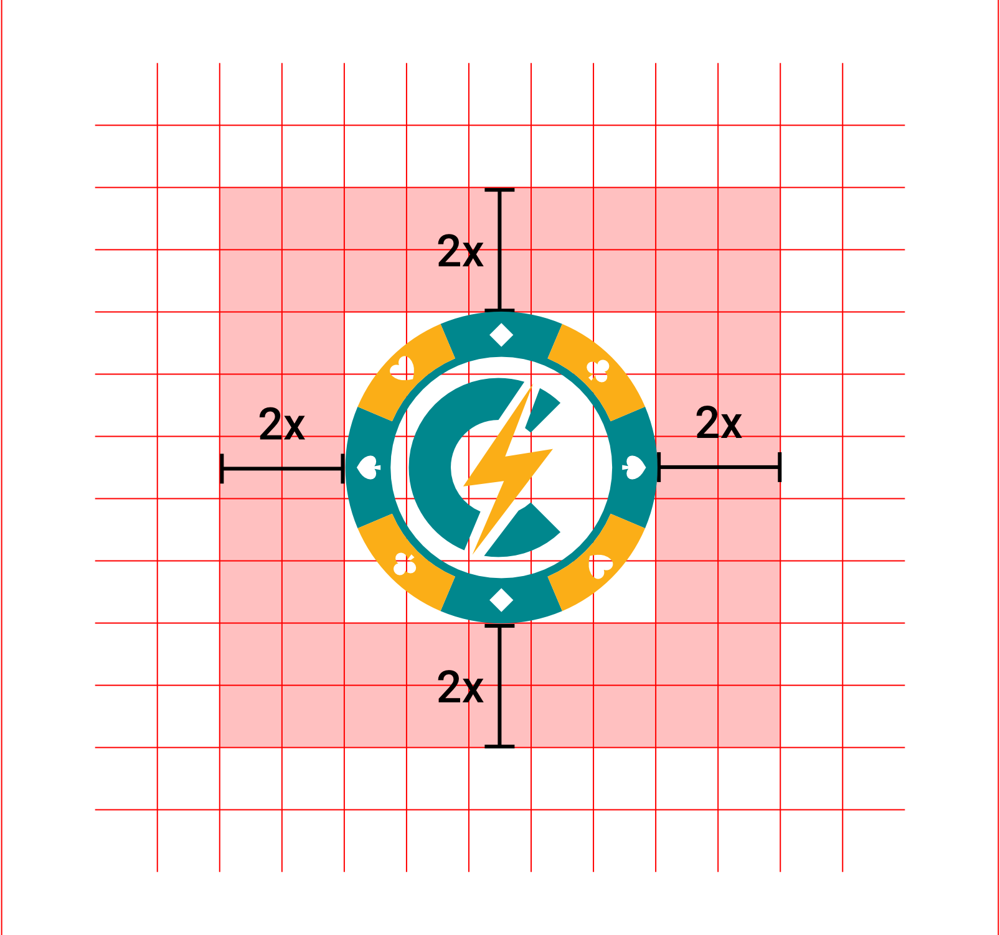
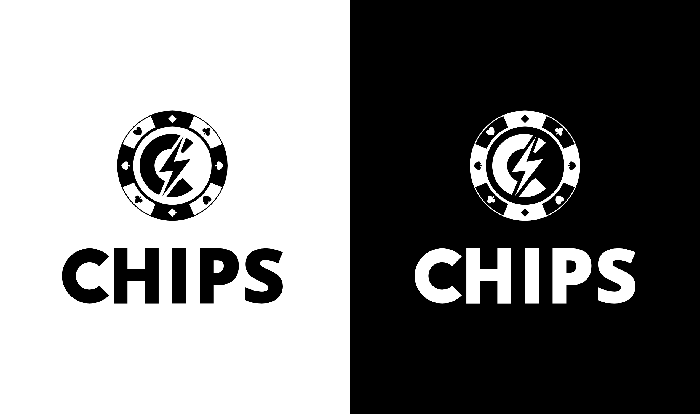

# **CHIPS LOGO GUIDELINE**

We restored our logo. Please pay attention to the following points when using our logo.

# Old Logo vs New Logo

&ensp;&ensp;&ensp;

[Old Logo v1 SVG](https://github.com/chips-blockchain/chips/tree/master/media/logo/chips-logo-old-v1.svg) 
[Old Logo v2 SVG](https://github.com/chips-blockchain/chips/tree/master/media/logo/chips-logo-old-v2.svg)

#

# Primary Logo

 

[Primary Logo PNG](https://github.com/chips-blockchain/chips/tree/master/media/logo/chips-logo-color.png) 
[Primary Logo SVG](https://github.com/chips-blockchain/chips/tree/master/media/logo/chips-logo-color.svg) 
[Logo Black PNG](https://github.com/chips-blockchain/chips/tree/master/media/logo/chips-logo-black.png) 
[Logo White PNG](https://github.com/chips-blockchain/chips/tree/master/media/logo/chips-logo-white.png)

#

# Logo Emblem

 

[Logo Emblem PNG](https://github.com/chips-blockchain/chips/tree/master/media/logo/chips-logo-emblem.png) 
[Logo Emblem SVG](https://github.com/chips-blockchain/chips/tree/master/media/logo/chips-logo-emblem.svg) 
[Emblem Black PNG](https://github.com/chips-blockchain/chips/tree/master/media/logo/chips-emblem-black.png) 
[Emblem White PNG](https://github.com/chips-blockchain/chips/tree/master/media/logo/chips-emblem-white.png)

#

# Logotype

 

[Logotype PNG](https://github.com/chips-blockchain/chips/tree/master/media/logo/chips-logotype-color.png) 
[Logotype SVG](https://github.com/chips-blockchain/chips/tree/master/media/logo/chips-logotype-color.svg) 
[Logotype Black PNG](https://github.com/chips-blockchain/chips/tree/master/media/logo/chips-logotype-black.png) 
[Logotype White PNG](https://github.com/chips-blockchain/chips/tree/master/media/logo/chips-logotype-white.png)

#

# Color HEX Codes

#

# Logo Proportions

The structure and proportions of the logo are explained with the image below.

#

# Logo Safety Area

As explained in the image below, at least two units of space should be left around the logo while placing it.

#

# Balack and White Logo Usage

#
